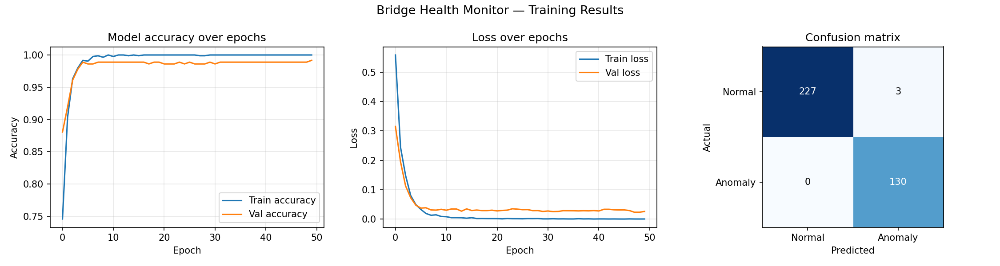

# Bridge-Health-Monitoring-System
This system is organized as a three-stage pipeline: (1) data acquisition from the MPU-6050 via I2C, (2) on-chip signal processing and TFLite inference on the ESP32, and (3) MQTT-based alerting to a cloud broker monitored by a live browser dashboard.

<div align="center">

# 🌉 Bridge Health Monitor

### Real-Time Structural Anomaly Detection using IoT + Edge ML

[](https://www.espressif.com/)
[](https://www.tensorflow.org/lite)
[](https://mqtt.org/)
[](https://python.org)
[](#-ml-pipeline)

<br/>

> **Bridges don't warn you before they fail — but now they can.**
>
> This project deploys a tiny neural network *directly on an ESP32 microcontroller* to detect structural vibration anomalies in real time, without relying on the cloud for inference.

<br/>


</div>

---

## 📖 Table of Contents

- [✨ Overview](#-overview)
- [🏗️ System Architecture](#️-system-architecture)
- [🧠 ML Pipeline](#-ml-pipeline)
- [📁 Repository Structure](#-repository-structure)
- [⚙️ Hardware Setup](#️-hardware-setup)
- [🚀 Getting Started](#-getting-started)
- [📡 MQTT Telemetry](#-mqtt-telemetry)
- [📊 Results](#-results)
- [🔬 How It Works — Deep Dive](#-how-it-works--deep-dive)
- [🛠️ Tech Stack](#️-tech-stack)
- [📸 Gallery](#-gallery)

---

## ✨ Overview

Infrastructure failure is one of the most preventable yet under-monitored problems in civil engineering. This project builds a **low-cost, low-power, always-on structural health monitoring node** using commodity hardware and on-device machine learning.

### What makes this different?

| Feature | Traditional Monitoring | This Project |
|---|---|---|
| **Inference location** | Remote server / cloud | 🟢 On the ESP32 itself |
| **Latency** | Seconds to minutes | 🟢 ~1.28 seconds per window |
| **Internet dependency** | Required for analysis | 🟢 Only for alerts |
| **Cost** | $$$$ | 🟢 ~$5 in hardware |
| **Model size** | Hundreds of MBs | 🟢 **13.2 KB** (TFLite int8) |

The ESP32 continuously reads vibration data from an MPU-6050 accelerometer, computes an FFT, runs a quantised neural network, and publishes anomaly alerts via MQTT — all without a round trip to the cloud.

---

## 🏗️ System Architecture

```
┌─────────────────────────────────────────────────────────────────────┐
│                          BRIDGE NODE                                │
│                                                                     │
│   MPU-6050          ESP32 (Edge Inference)          Wi-Fi           │
│  ┌────────┐        ┌──────────────────────┐       ┌──────┐         │
│  │ 3-axis │──I²C──▶│  1. Sample 128pts    │──────▶│ MQTT │         │
│  │  Accel │        │  2. Compute FFT      │       │Broker│         │
│  └────────┘        │  3. Scale features   │       └──┬───┘         │
│                    │  4. TFLite int8 infer│          │              │
│                    │  5. Threshold check  │          │              │
│                    └──────────────────────┘          │              │
└──────────────────────────────────────────────────────┼─────────────┘
                                                       │
                          ┌────────────────────────────▼────────────┐
                          │           CLOUD / DASHBOARD             │
                          │                                         │
                          │   bridge/sensor/data  ──▶  Live Feed    │
                          │   bridge/sensor/alert ──▶  🚨 Alerts    │
                          └─────────────────────────────────────────┘
```

### Inference Window

Every **1.28 seconds**, the ESP32 collects 128 accelerometer samples at 100 Hz and runs one full inference cycle:

```
128 raw samples (ax, ay, az)
        │
        ▼
   FFT (32 bins × 3 axes)
        │
        ▼
   96-dim feature vector
        │
        ▼
   StandardScaler (z-score)
        │
        ▼
   TFLite int8 model (13.2 KB)
        │
        ▼
   Anomaly score [0.0 – 1.0]
        │
   > 0.5 for 3 consecutive windows?
        │
        ▼
   📡 Publish MQTT Alert
```

---

## 🧠 ML Pipeline

The entire training pipeline lives in [`BridgeHealth.ipynb`](BridgeHealth.ipynb).

### Dataset

- **76,800 raw accelerometer rows** (`vibration_data.csv`)
- **1,198 labeled windows** after 50% overlap windowing
- **Balanced classes:** 764 Normal / 434 Anomaly
- **Split:** 70% train / 30% test, stratified

### Feature Engineering — Why FFT?

Raw accelerometer time series are noisy and hard to classify directly. A **Fast Fourier Transform** converts each window into a frequency spectrum.

The key insight:

- 🟢 **Healthy bridge** → energy concentrated at **6–10 Hz** (normal traffic loading)
- 🔴 **Damaged bridge** → energy shifts to **2–5 Hz** + new harmonics appear (structural resonance change)

This makes the classification boundary *much* cleaner for the neural network.

```python
fft_ax = np.abs(np.fft.rfft(ax))[:32]   # 32 bins from X-axis
fft_ay = np.abs(np.fft.rfft(ay))[:32]   # 32 bins from Y-axis
fft_az = np.abs(np.fft.rfft(az))[:32]   # 32 bins from Z-axis

feature_vector = np.concatenate([fft_ax, fft_ay, fft_az])  # → 96 features
```

### Model Architecture

Deliberately tiny to fit in ESP32 RAM (~320 KB):

```
Input (96 features)
      │
   Dense(64, ReLU)
      │
   Dropout(0.2)
      │
   Dense(32, ReLU)
      │
   Dropout(0.2)
      │
   Dense(1, Sigmoid)
      │
  Output: P(anomaly)
```

| Layer | Parameters |
|---|---|
| Dense 96→64 | 6,208 |
| Dense 64→32 | 2,080 |
| Dense 32→1 | 33 |
| **Total** | **8,321** |

### Quantisation

The trained Keras model is converted to **TFLite int8** — reducing weights from 32-bit floats to 8-bit integers:

- 📦 Model size: **13.2 KB** (uses just **4.1%** of ESP32 RAM)
- ⚡ Inference speed: ~2× faster than float32
- 🎯 Accuracy loss: negligible (<1%)

### Training Results



| Metric | Normal | Anomaly | Overall |
|---|---|---|---|
| Precision | 1.00 | 0.98 | — |
| Recall | 0.99 | 1.00 | — |
| F1-score | 0.99 | 0.99 | — |
| **Accuracy** | — | — | **99%** |

---

## 📁 Repository Structure

```
bridge-health-monitor/
│
├── 📓 BridgeHealth.ipynb              # Full ML training pipeline (Colab-ready)
├── 📓 MQTTPublisher.ipynb             # Sensor data simulator + MQTT publisher
├── 📓 MQTTSubscriber.ipynb            # Live dashboard subscriber
│
├── 🤖 bridge_monitor_final.ino        # ESP32 Arduino sketch (main firmware)
├── 🧠 bridge_model.h                  # TFLite model as C byte array (for flashing)
├── 🧠 bridge_model.tflite             # Raw TFLite model file
│
├── 📊 vibration_data.csv              # Training dataset (76,800 rows)
│
└── docs/images/
    ├── Bridge Health Live Dashboard.png   # Live dashboard screenshot
    ├── Hardware setup.jpeg                # Physical wiring photo
    ├── MQTT Server details.jpg            # MQTT broker config
    ├── Output from Hardware.jpeg          # Real ESP32 serial output
    ├── Output message.jpeg                # MQTT message output
    ├── output together.jpeg               # Combined system output
    └── training_results.png               # Accuracy/loss/confusion matrix
```

---

## ⚙️ Hardware Setup

### Components Required

| Component | Purpose | Cost (approx.) |
|---|---|---|
| ESP32 Dev Board | Microcontroller + Wi-Fi + ML inference | ~$3 |
| MPU-6050 | 3-axis accelerometer + gyroscope | ~$1 |
| Jumper Wires | Connections | ~$0.50 |
| **Total** | | **~$4.50** |

### Wiring Diagram

```
ESP32           MPU-6050
─────           ────────
3.3V    ──────▶ VCC
GND     ──────▶ GND
GPIO21  ──────▶ SDA   (I²C Data)
GPIO22  ──────▶ SCL   (I²C Clock)
```

### Hardware in Action


### Sensor Configuration (in firmware)

```cpp
mpu.setAccelerometerRange(MPU6050_RANGE_2_G);   // ±2g for bridge vibrations
mpu.setFilterBandwidth(MPU6050_BAND_21_HZ);     // Low-pass filter
```

---

## 🚀 Getting Started

### 1. Clone the Repository

```bash
git clone https://github.com/YOUR_USERNAME/bridge-health-monitor.git
cd bridge-health-monitor
```

### 2. Train the Model (Google Colab recommended)

Open `BridgeHealth.ipynb` in Colab and run all cells. This will:
- Load `vibration_data.csv`
- Extract FFT features
- Train the neural network (50 epochs, ~2 minutes)
- Export `bridge_model.tflite` + `scaler_params.json`

### 3. Flash the ESP32

**Install Arduino Libraries** (via Library Manager):
- `Adafruit MPU6050`
- `Adafruit Unified Sensor`
- `TensorFlowLite_ESP32`
- `ArduinoFFT`
- `PubSubClient`
- `ArduinoJson`

**Convert the model to a C header:**
```bash
xxd -i bridge_model.tflite > bridge_model.h
```

**Edit `bridge_monitor_final.ino`:**
```cpp
const char* WIFI_SSID     = "YOUR_WIFI_SSID";
const char* WIFI_PASSWORD = "YOUR_WIFI_PASSWORD";
```

**Copy scaler parameters** from `scaler_params.json` into the sketch:
```cpp
float FEATURE_MEAN[96]  = { /* paste values here */ };
float FEATURE_SCALE[96] = { /* paste values here */ };
```

Then upload to your ESP32 via Arduino IDE.

### 4. Monitor the Dashboard

Run `MQTTSubscriber.ipynb` in Colab — it listens on:

| Topic | Contents |
|---|---|
| `bridge/sensor/data` | Live ax, ay, az, temperature readings |
| `bridge/sensor/alert` | Anomaly alerts with severity + score |

### 5. (Optional) Run the Simulator

No hardware? Run `MQTTPublisher.ipynb` to simulate sensor data — including synthetic anomaly bursts every 30 seconds.

---

## 📡 MQTT Telemetry

The system publishes two types of MQTT messages to a public HiveMQ broker.

### Live Sensor Data (`bridge/sensor/data`)

```json
{
  "device": "bridge-node-01",
  "timestamp": 1420.5,
  "ax": 0.432,
  "ay": -0.217,
  "az": 9.801,
  "temp_c": 28.6
}
```

### Anomaly Alert (`bridge/sensor/alert`)

Published (as a **retained message**) when anomaly persists for 3+ consecutive inference windows:

```json
{
  "device": "bridge-node-01",
  "alert": "STRUCTURAL_ANOMALY_DETECTED",
  "score": 0.921,
  "severity": "HIGH",
  "message": "Unusual vibration pattern detected. Inspection recommended."
}
```

> Severity is `HIGH` when score > 0.85, otherwise `MEDIUM`.

### MQTT Configuration

| Setting | Value |
|---|---|
| Broker | `broker.hivemq.com` |
| Port | `1883` |
| Data Topic | `bridge/sensor/data` |
| Alert Topic | `bridge/sensor/alert` |
| Status Topic | `bridge/status` |


---

## 📊 Results

### Live Dashboard

The subscriber notebook renders a real-time view of all incoming sensor data and fires visual alerts on anomaly detection.


### Serial Output from ESP32


### System Output Together


---

## 🔬 How It Works — Deep Dive

### Why Edge Inference?

Running the neural network **on the ESP32** (rather than sending raw data to the cloud) has three major benefits:

1. **Latency** — Detection happens within the 1.28-second window, not after a round-trip to a server
2. **Bandwidth** — Only anomaly *alerts* are sent over Wi-Fi, not 100 Hz raw streams
3. **Reliability** — The system keeps monitoring even with intermittent internet connectivity

### The Anomaly Logic

To avoid false alarms from sensor noise, the firmware requires **3 consecutive anomalous windows** before firing an MQTT alert:

```cpp
if (isAnomaly) {
    anomalyCount++;
    if (anomalyCount >= 3) {
        publishAlert(output_float);   // ~3.84 seconds of sustained anomaly
        anomalyCount = 0;
    }
} else {
    anomalyCount = 0;   // Reset on any normal window
}
```

### int8 Quantisation on the ESP32

The TFLite model uses integer arithmetic everywhere. Input features must be quantised before inference and outputs dequantised after:

```cpp
// Quantise input
int8_t q = (int8_t)(feature / input_scale + input_zero_point);
input_tensor->data.int8[i] = q;

// Run inference
interpreter->Invoke();

// Dequantise output
float score = (output_tensor->data.int8[0] - output_zero_point) * output_scale;
```

The scale and zero-point values come directly from the TFLite model's quantisation parameters.

---

## 🛠️ Tech Stack

| Layer | Technology |
|---|---|
| **Hardware** | ESP32, MPU-6050 (I²C) |
| **Firmware** | Arduino C++, TFLite Micro, ArduinoFFT |
| **ML Training** | Python, TensorFlow/Keras, NumPy, scikit-learn |
| **Model Format** | TFLite (int8 full quantisation) |
| **Communication** | MQTT over Wi-Fi (HiveMQ public broker) |
| **Development** | Google Colab, Arduino IDE |

---

## 📸 Gallery

<table>
  <tr>
    <td align="center"><br/><sub>Hardware wiring</sub></td>
    <td align="center"><br/><sub>Training results</sub></td>
  </tr>
  <tr>
    <td align="center"><br/><sub>ESP32 serial output</sub></td>
    <td align="center"><br/><sub>MQTT alert message</sub></td>
  </tr>
</table>

---


> **Note:** `vibration_data.csv` is ~5 MB. GitHub handles files up to 100 MB natively. If you later add real sensor data that grows larger, consider [Git LFS](https://git-lfs.github.com/).

---

<div align="center">

Made with ❤️ | IoT × Edge ML × Structural Health Monitoring

</div>
